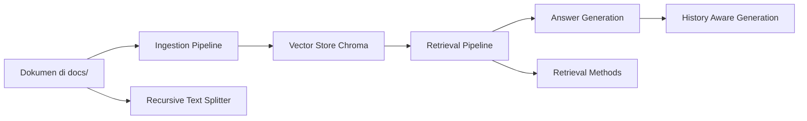

# Complete RAG Tutorial

	
	
	

	Panduan praktik untuk mempelajari Retrieval Augmented Generation dari ingestion, retrieval, answer generation, history-aware retrieval, hingga variasi metode retrieval.

---

## Ringkasan

Repository ini berisi rangkaian notebook Python untuk membangun alur RAG secara bertahap. Struktur project dibuat agar mudah diikuti, mulai dari memecah dokumen, menyimpan embedding ke vector database, melakukan pencarian, lalu menggabungkannya dengan model bahasa untuk menghasilkan jawaban.

## Alur Belajar

## Isi Notebook

| Notebook                           | Fokus                                                                 |
| ---------------------------------- | --------------------------------------------------------------------- |
| `1_ingestion_pipeline.ipynb`       | Menyiapkan dokumen, memproses data, dan membangun pipeline ingestion. |
| `2_retrieval-pipeline.ipynb`       | Mencari konteks relevan dari vector database.                         |
| `3_answer_generation.ipynb`        | Menggabungkan konteks hasil retrieval dengan LLM untuk jawaban akhir. |
| `4_history_aware_generation.ipynb` | Membuat jawaban yang mempertimbangkan riwayat percakapan.             |
| `5_recursite-text-splitter.ipynb`  | Eksperimen pemecahan teks, termasuk `RecursiveCharacterTextSplitter`. |
| `9_retrieval-methods.ipynb`        | Membandingkan beberapa pendekatan retrieval.                          |

## Struktur Folder

| Path            | Isi                                                                           |
| --------------- | ----------------------------------------------------------------------------- |
| `docs/`         | Kumpulan dokumen sumber seperti Google, Microsoft, Nvidia, SpaceX, dan Tesla. |
| `db/chroma_db/` | Penyimpanan vector database Chroma untuk hasil embedding.                     |
| `README.md`     | Ringkasan project dan panduan navigasi notebook.                              |

## Cara Menggunakan

1. Buka notebook sesuai urutan belajar yang ingin diikuti.
2. Mulai dari `1_ingestion_pipeline.ipynb` untuk memahami bagaimana data masuk ke sistem.
3. Lanjutkan ke notebook retrieval dan answer generation untuk melihat alur RAG end-to-end.
4. Gunakan notebook eksperimen untuk membandingkan strategi split text dan retrieval.

## Dataset dan Storage

Project ini menggunakan dokumen contoh yang sudah tersedia di folder `docs/` dan vector store lokal di `db/chroma_db/`. Dengan struktur ini, notebook dapat dijalankan tanpa perlu menyiapkan sumber data dari awal.

## Catatan

- Notebook belum semuanya dieksekusi, jadi beberapa output mungkin masih kosong sampai dijalankan.
- Jika ingin memperluas tutorial, folder `docs/` bisa ditambah dengan sumber dokumen lain untuk eksperimen retrieval yang lebih kaya.
