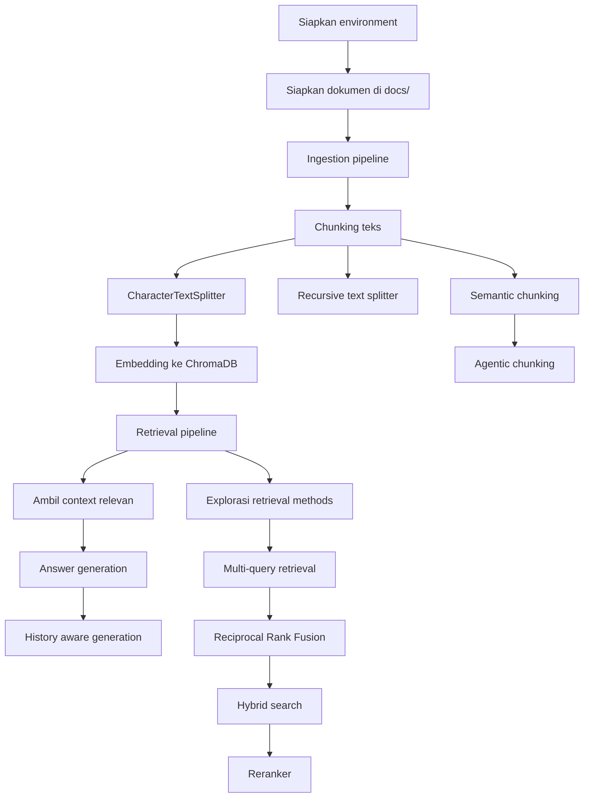

# RAG Tutorial

Kumpulan materi belajar Retrieval-Augmented Generation (RAG) dari dasar sampai teknik retrieval yang lebih lanjut. Repositori ini berisi script, notebook, dan data contoh untuk memahami alur lengkap: ingest dokumen, membangun vector store, melakukan retrieval, lalu menghasilkan jawaban.

## Tujuan Proyek

- Memahami alur kerja RAG secara bertahap.
- Mencoba berbagai strategi chunking, retrieval, dan ranking.
- Melatih eksperimen dengan dataset teks lokal yang disimpan di folder `docs/`.
- Menjadi referensi belajar yang bisa dijalankan satu per satu.

## Struktur Folder

- `1_ingestion_pipeline.py` - load dokumen, split teks, dan simpan embedding ke ChromaDB.
- `2_retrieval_pipeline.py` - melakukan pencarian context dari vector store.
- `3_answer_generate.py` - menggabungkan retrieval dengan model LLM untuk membuat jawaban.
- `4_history_aware_generation.py` - generasi jawaban yang mempertimbangkan percakapan sebelumnya.
- `5_recursive_text_splitter.py` - eksplorasi teknik recursive text splitting.
- `6_semantic_chunking.py` / `6_semantic_chunking.ipynb` - chunking berbasis makna.
- `7_agentic_chunking.ipynb` - eksplorasi chunking dengan pendekatan agentic.
- `9_retrieval_methods.py` - perbandingan metode retrieval.
- `10_multi_query_retrieval.py` / `10_multi_query_retrieval.ipynb` - multi-query retrieval.
- `11_repricol_rank_fusion.py` / `11_repricocal_rank_fusion.ipynb` - reciprocal rank fusion.
- `12_hybrid_search.ipynb` - hybrid search.
- `13_reranker.ipynb` - reranking hasil retrieval.
- `docs/` - dokumen sumber untuk diindeks.
- `db/chroma_db/` - penyimpanan vector database Chroma.

## Workflow Belajar



Urutan belajar yang disarankan:

1. Pahami dulu konsep RAG: dokumen -> embedding -> retrieval -> jawaban.
2. Jalankan `1_ingestion_pipeline.py` untuk melihat bagaimana dokumen dimuat, dipecah, lalu disimpan ke ChromaDB.
3. Jalankan `2_retrieval_pipeline.py` untuk memahami bagaimana query mencari context yang relevan.
4. Jalankan `3_answer_generate.py` untuk melihat bagaimana context dipakai model dalam menghasilkan jawaban.
5. Lanjut ke `4_history_aware_generation.py` agar paham percakapan multi-turn.
6. Pelajari variasi chunking lewat `5_recursive_text_splitter.py`, `6_semantic_chunking.py`, dan `7_agentic_chunking.ipynb`.
7. Bandingkan teknik retrieval lanjutan lewat `9_retrieval_methods.py`, `10_multi_query_retrieval.py`, `11_repricol_rank_fusion.py`, `12_hybrid_search.ipynb`, dan `13_reranker.ipynb`.

## Cara Menjalankan

1. Masukkan dokumen `.txt` ke folder `docs/`.
2. Jalankan pipeline ingestion terlebih dahulu.
3. Setelah vector store terbentuk di `db/chroma_db/`, jalankan script retrieval dan generation.

Contoh:

```bash
python 1_ingestion_pipeline.py
python 2_retrieval_pipeline.py
python 3_answer_generate.py
```

## Catatan Data

- Dataset contoh berupa file `.txt` di folder `docs/`.
- Vector store Chroma tersimpan lokal di `db/chroma_db/`.
- Jika ingin eksperimen ulang, hapus atau ganti isi dokumen lalu jalankan ulang ingestion.

## Pengembangan Lanjutan

Jika ingin memperluas proyek ini, alur yang paling natural adalah:

1. Tambahkan dokumen baru ke `docs/`.
2. Uji chunking dengan ukuran dan strategi berbeda.
3. Bandingkan hasil retrieval dengan beberapa query.
4. Tambahkan reranker atau hybrid search untuk meningkatkan kualitas context.
5. Evaluasi jawaban dengan skenario pertanyaan yang lebih kompleks.
